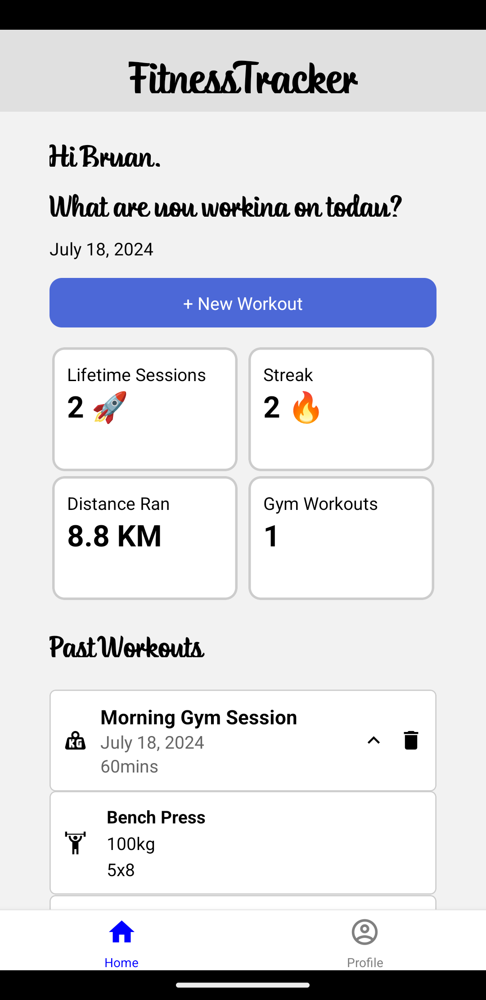

# Fitness Tracker

Welcome to the Fitness Tracker application! This app is developed using React Native and aims to help users monitor and improve their fitness levels by tracking various activities.

## Table of Contents

- [Features](#features)
- [Screenshots](#screenshots)
- [Installation](#installation)
- [Usage](#usage)
- [Technologies Used](#technologies-used)
- [Contact](#contact)

## Features

- **Activity Tracking**: Track your daily activities like walking, running, and gym sessions.
- **Progress Reports**: View detailed reports and analytics of your progress over time.

## Screenshots



## Installation

To run this application on your local machine, follow these steps:

1. **Clone the Repository**:
   ```bash
   git clone https://github.com/bryanngzh/fitness-tracker.git
   ```
2. **Navigate to the Project Directory**:
   ```bash
   cd fitness-tracker
   ```
3. **Install Dependencies**:
   ```bash
   npm install
   ```
4. **Run the Application**:
   ```bash
   npm start
   ```
5. **Update .env folder**:
   ```bash
   FIREBASE_API_KEY=
   FIREBASE_AUTH_DOMAIN=
   FIREBASE_PROJECT_ID=
   FIREBASE_STORAGE_BUCKET=
   FIREBASE_MESSAGING_SENDER_ID=
   FIREBASE_APP_ID=
   REACT_APP_API_URL=
   ```
6. **Start the Emulator** (or connect a physical device):
   ```bash
   npx react-native run-android  # For Android
   npx react-native run-ios      # For iOS
   ```

## Usage

Once the app is installed, you can:

- Create an account or log in.
- Set up your profile with your health metrics.
- Start tracking your activities and set fitness goals.
- View your progress reports and adjust your routines as needed.

## Technologies Used

- **React Native**: For building the cross-platform mobile application.
- **React Navigation**: For navigation and routing.
- **Node.js**: For REST APIs.
- **Firebase**: For authentication and backend services.
- **Expo**: For a streamlined development workflow.

## Contact

If you have any questions, suggestions, or feedback, feel free to reach out:

- **GitHub**: [bryanngzh](https://github.com/bryanngzh)

Thank you for using the Fitness Tracker application!
